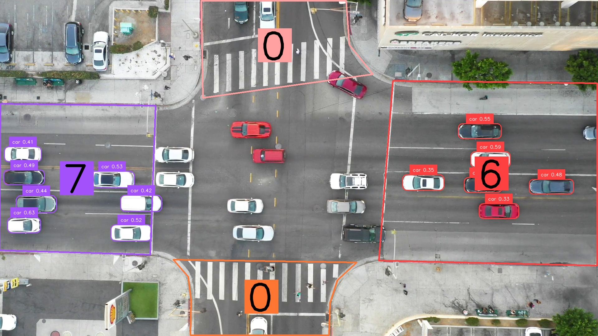
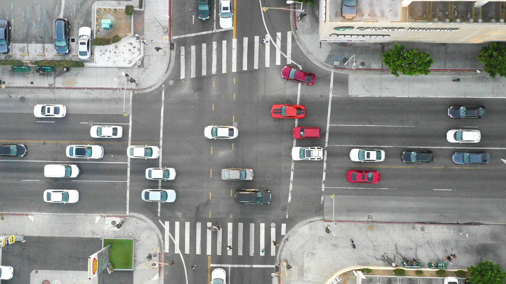
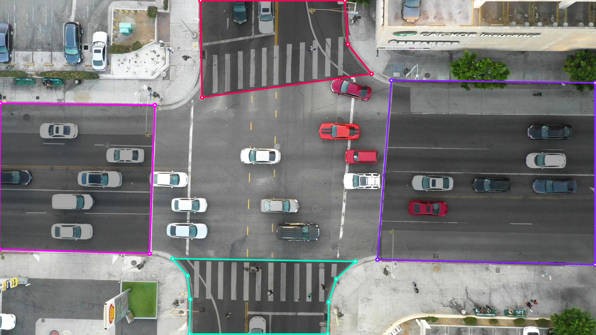

# ZoneVision

Detect objects within custom-defined polygonal zones in a video stream. This project uses the YOLOE object detection model via `ultralytics` and the `supervision` library for zone management and annotation.

The images used in this README (`Frame_with_zones.png` and `first_frame.jpg`) are located in the `PolygonZone/` directory.



## Description

ZoneVision processes a video file or RTSP stream (e.g., `videos/Intersection.mp4`) frame by frame. It identifies objects using a pre-trained YOLOE model. The script allows users to define multiple polygonal zones and highlights objects detected within these specific areas.

The current implementation in `main.py` detects specific classes (`car`, `motorcycle`, `bus`, `truck`) and uses hardcoded zones, but it can be modified to detect other object types and use different zone configurations. Additionally, it can be used to process live video streams from cameras.

## Features

- Object detection using YOLOE model.
- Configurable object classes for detection (requires modification in `main.py`).
- Support for multiple, user-definable polygonal zones (modifiable in `main.py`).
- Visual annotation of detected objects within zones using bounding boxes and labels.
- Annotation of the defined zones on the video frames.
- Saves the first frame of the video (`PolygonZone/first_frame.jpg`) to assist in defining zones using tools like [PolygonZone by Roboflow](https://polygonzone.roboflow.com/).



After defining zones using PolygonZone, you can use the coordinates in the `polygons` list in `main.py`.

Image shows the zones defined in the `polygons` list in `main.py`.


## Installation

This project uses `uv` as the package manager.

1. **Clone the repository (if applicable):**

    ```bash
    git clone https://github.com/NourEldin-Osama/ZoneVision
    cd ZoneVision
    ```

2. **Create a virtual environment (recommended):**

    ```bash
    uv venv
    ```

3. **Install dependencies using uv:**
    Make sure you have `uv` installed (`pip install uv`).

    ```bash
    # Install dependencies listed in pyproject.toml
    uv pip install -r pyproject.toml
    uv pip install pip
    ```

    *Note: Ensure you install the correct PyTorch version (CPU or specific CUDA version) for your system.*

## Usage

1. Place your input video file in the `videos/` directory (or update the `video_path` variable in `main.py`).
2. **Define Zones:** Modify the `polygons` list in `main.py` with the desired coordinates for your zones. You can use the `PolygonZone/first_frame.jpg` image (generated on the first run if it doesn't exist) and a tool like [PolygonZone](https://polygonzone.roboflow.com/) to get the coordinates.
3. **(Optional) Modify Detected Classes:** To detect different objects, update the `names` list in `main.py`. Refer to the `ultralytics` documentation for available classes or custom model usage.
4. Run the main script:

    ```bash
    uv run main.py
    ```

5. An OpenCV window titled "ZoneVision" will open, displaying the video with annotated zones and detections.
6. Press 'q' to quit the video display.

## Dependencies

- `supervision`
- `ultralytics`
- `opencv-python` (implied dependency via supervision)
- `numpy` (implied dependency)
- `pillow`
- `torch`
- `torchvision`

See `pyproject.toml` for specific version requirements.
